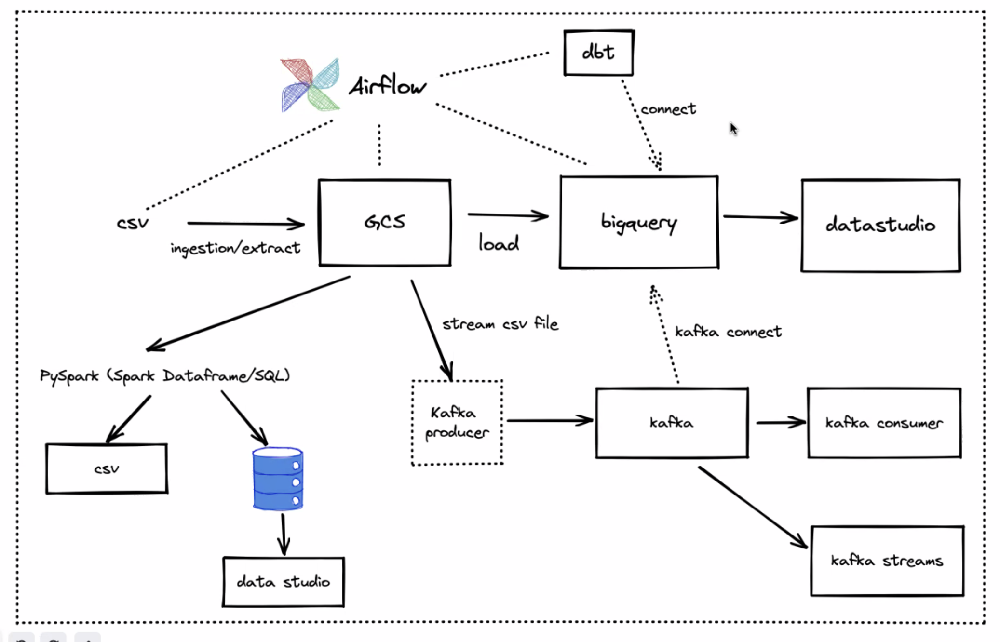

# Reproducibility

This repository is for Final Project of Data Engineering-Data Fellowship Program by IYKRA which is done by Kelompok 5. For raw data you can [Access Here](https://storage.googleapis.com/wfwijaya-fellowship/bank-marketing.csv) or [Access Here](bank-additional-full-raw.csv)

Expected workflow for this project is


## Steps:

## 1. Using Terraform as IaC

- Create GCP service account and generate [google credentials](https://developers.google.com/workspace/guides/create-credentials)
- Create a folder and put google credentials there
- Create [main.tf](IaC-using-terraform\main.tf) and [variables.tf](IaC-using-terraform\variables.tf) files (edit as your need)
- In that folder, run terminal
- Initialize state file
``` 
terraform init
```
- Check the new infra plan
```
terraform plan
```
- Apply the new infra plan
```
terraform apply
```
- Now your infra has been automatically created!
- Delete infra after your work done, to avoid costs on any running services
```
terraform destroy
```

## 2. Using Airflow to Ingest Data

Task for this airflow is:
```
download dataset task >>> local to gcs >>> gcs to bigquery
```

- Prequisite

    A. Python 3 : [Download Here](https://www.python.org/downloads/)
    
    B. Google Cloud SDK : [Download Here](https://cloud.google.com/sdk/docs/install)
    
    C. Docker : [Download Here](https://cloud.google.com/sdk/docs/install)

    D. Docker Compose : [Download Here](https://docs.docker.com/compose/install/)

    E. Get Google Cloud Credentials : [Access Here](https://developers.google.com/workspace/guides/create-credentials)
    
    Rename the google credentials into `google_credentials.json` and store it in your `$HOME` directory

- Pull/Download whole [cleaning-using-spark](cleaning-using-spark/) folder

- Create a python script for DAG (task that running in airflow) as : [bank_weekly_ingest_dag.py](data-ingestion-using-airflow\dags\bank_weekly_ingest_dag.py)

- How to run (in terminal)

    A. Build the image :
    ```
    docker-compose build
    ```

    B. Initialize the Airflow scheduler, DB, and other config :
    ```
    docker-compose up airflow-init
    ```

    C. Kick up the all the services from the container :
    ```
    docker-compose up
    ```

    D. In another terminal, run 
    ```
    docker-compose ps
    ``` 
    to see which containers are up & running (there should be 7, matching with the services in your docker-compose file).

    E. Login to Airflow web UI on `localhost:8080` with default creds : `airflow/airflow`

    F.  Run your DAGs on the Web Console

    G. On finishing your run or to shut down the container :   
    ```
    docker-compose down
    ```
## 3. Data Warehouse (BigQuery)

We use BigQuery as Data Warehouse. We use cleaning and clustering using [cleaning_data.sql](query-in-bigquery\cleaning-data.sql)
and then we send it back to data-lake to be used by other process using [export_data.sql](query-in-bigquery\export_data.sql)

We also use the clean data to create a Dashboard and run dbt transform

## 4. Transform using dbt-cloud

- Prequisites

    A. Get Google Cloud Credentials : [Access Here](https://developers.google.com/workspace/guides/create-credentials)

    B. Get dbt Cloud Account : [Access Here](https://www.getdbt.com/signup/)

- Set up and Connect BigQuery with dbt :
    
    A. Click BigQuery to set up your connection.
    
    B. Click Upload a Service Account JSON File in BigQuery settings.
    
    C. Select the JSON file you downloaded in Generate BigQuery Credentials. dbt Cloud will fill in all the necessary fields.
    
    D. Click Test at the top. This verifies that dbt Cloud can access your BigQuery account.

    E. If you see "Connection test Succeeded!" then click Continue. If it fails, you might need to go back and regenerate your BigQuery credentials.

    For more details explanation you can [Access dbt Docs](https://docs.getdbt.com/guides/getting-started/getting-set-up/setting-up-bigquery)

- Create schema and query file inside the dbt-cloud. For example you can see [here](transformation-using-dbt)

- How to Run :

    A. Run with command :
    ```
    dbt run
    ```

    B. If you want to test, run with command:
    ```
    dbt test
    ```

    C. To get docs run with command :
    ```
    dbt docs generate
    ```

## 5. Transform using pySpark

- Prequisites :

    A. Python 3 : [Download Here](https://www.python.org/downloads/)

    B. Java 8 or Later : [Download Here](https://www.java.com/en/download/)

    C. Jupyter Notebook / Visual Studio Code

    D. Apache pySpark : [Download Here](https://spark.apache.org/downloads.html)

    E. winutils.exe : [Access Here](https://github.com/steveloughran/winutils/blob/master/hadoop-2.7.1/bin/winutils.exe)

- How Set up PySpark:

    A. Install Java
    
    Set your Java path with this:
    ```
    JAVA_HOME = C:\Program Files\Java\jdk1.8.0_201
    ```
    ```
    PATH = %PATH%;C:\Program Files\Java\jdk1.8.0_201\bin
    ```
    B. PySpark Install on Windows
    
    copy the extracted Apache PySpark to folder to c:\apps and set environment variables with:
    ```
    SPARK_HOME = C:\apps\spark-3.0.0-bin-hadoop2.7
    ```
    ```
    HADOOP_HOME = C:\apps\spark-3.0.0-bin-hadoop2.7
    ```
    ```
    PATH=%PATH%;C:\apps\spark-3.0.0-bin-hadoop2.7\bin
    ```

    Remember to change the path based on your spark version and after successfully setting up environment variables, install `winutils.exe` on your windows system and copy it to `%SPARK_HOME%\bin` folder. Note that winutils is different for each Hadoop version and you can download the right version from this link.

    Now you can open pyspark by typing `pyspark` on your `command prompt` or `anaconda prompt`. To access web UI, it will be set as default `https://localhost:4040`, note that if you close your command prompt you can't open the web UI.
    C. Run PySpark in Jupyter Notebook
    
    Run command :
    ```
    import findspark

    findspark.init()
    ```


- How to Run :

    A. Create a `.ipynb` file using `Jupyter Notebook`. For Example you can see [bank_marketing_transform_pySpark.ipynb](transformation-using-pyspark\bank_marketing_transform_pySpark.ipynb)

    B. Write the code and press `Shift + Enter` or press the play button in the toolbar above.

## 6. Data Streaming with Kafka Producer and Kafka Consumer

- Prequisites :

    A. Python 3 : [download here](https://www.python.org/downloads/)

    B. Kafka Confluent
    ```
    pip install confluent_kafka
    ```

    C. Docker : [Download Here](https://cloud.google.com/sdk/docs/install)

    D. Docker Compose : [Download Here](https://docs.docker.com/compose/install/)

- Pull/Download whole [streaming-using-kafka](streaming-using-kafka/) folder

- Create python files for [Kafka Producer](streaming-using-kafka\bank_producer.py) and [Kafka Consumer](streaming-using-kafka\bank_consumer.py)

- Create Avro files (for schema) for [Schema Key](streaming-using-kafka\bank_key.avsc) and [Schema Value](streaming-using-kafka\bank_value.avsc)

- How to Run (in terminal) :
    A. Build the image :
    ```
    docker-compose build
    ```

    B. Kick up the all the services from the container :
    ```
    docker-compose up
    ```

    C. In another terminal, run 
    ```
    docker-compose ps
    ``` 

    D. Open up terminal, run
    ```
    python <kafka producer>.py
    ```
    If success, you would see moving log in your terminal

    E. While the kafka producer running, open up new terminal and run
    ```
    python <kafka consumer>.py
    ```
    If success, you would see moving log in your terminal
    
    F. Monitor the broker and topic in [Control Center](localhost://9021)

## 7. Streaming to BigQuery table

For streaming to Bigquery, you need to create topics and subscriber in your [pub/sub console](https://console.cloud.google.com/cloudpubsub)
or you can follow the instruction [here](https://cloud.google.com/pubsub)

```
Note : You need to build schema beforehand when you create topic
```

- Get Google Cloud Credentials : [Access Here](https://developers.google.com/workspace/guides/create-credentials)

- Pull/Download whole [streaming-to-bigquery](streaming-to-bigquery/) folder

- How to Run (in terminal) :
    A. Build the image :
    ```
    docker-compose build
    ```

    B. Kick up the all the services from the container :
    ```
    docker-compose up
    ```

    C. In another terminal, run 
    ```
    docker-compose ps
    ``` 

    D. Open up terminal, run
    ```
    python <streaming topic>.py
    ```
    If success, you would see moving log in your terminal

    E. While the topic running, open up new terminal and run
    ```
    python <streaming subscriber>.py
    ```
    If success, you would see moving log in your terminal

## 8. Dashboard

Dashboard for this project is build on [Google Data Studio](https://datastudio.google.com/reporting/e5550219-7e91-4779-a0da-cdf344342016)

